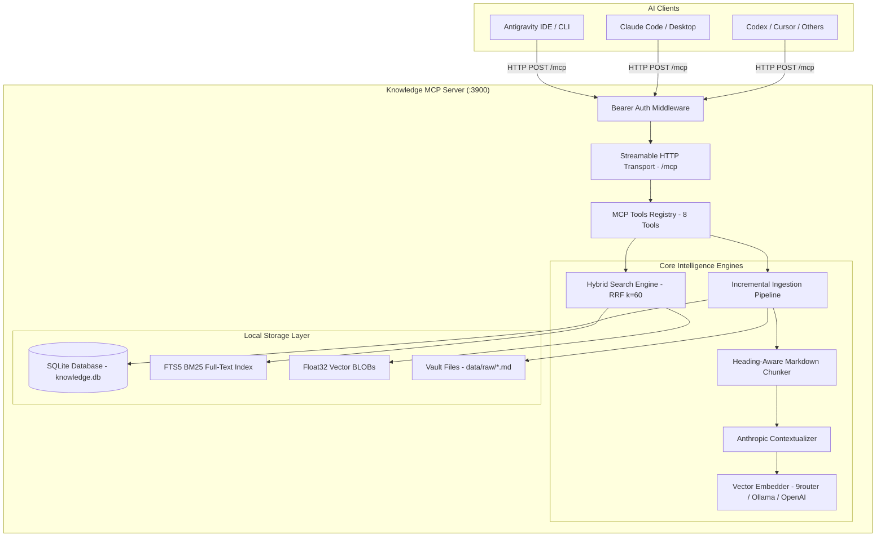

<div align="center">

# 🧠 Knowledge MCP Server

**The High-Performance, Local-First Second Brain & Knowledge Base for AI Agents**

[](https://opensource.org/licenses/MIT)
[](https://nodejs.org/)
[](https://www.typescriptlang.org/)
[](https://modelcontextprotocol.io/)
[](https://github.com/)

[**English**](README.md) • [**Tiếng Việt**](README.vi.md) • [**Roadmap**](ROADMAP.md) • [**Setup Guide**](SETUP_NEW_MACHINE.md)

</div>

---

## 💡 What is Knowledge MCP?

**Knowledge MCP Server** is a blazing-fast, local-first Knowledge Management & Retrieval-Augmented Generation (RAG) system exposed via the open **Model Context Protocol (MCP)** standard. 

It empowers AI coding assistants and autonomous agents (**Antigravity IDE / CLI**, **Claude Code**, **Cursor**, **ChatGPT / Codex**, **Windsurf**) to seamlessly search, read, create, and maintain your personal or enterprise knowledge vault with **zero cloud dependencies** and **zero data leakage**.

```
┌─────────────────┐       Streamable HTTP       ┌──────────────────────────────────────┐
│  AI Assistants  │ ──────────────────────────> │        Knowledge MCP Server          │
│ (Antigravity /  │                             │ ┌──────────────────────────────────┐ │
│  Claude / Cursor│ <────────────────────────── │ │ Hybrid Search (BM25 + Vector)    │ │
└─────────────────┘                             │ │ Anthropic Contextual Retrieval   │ │
                                                │ │ Heading-Aware Markdown Chunker   │ │
                                                │ │ Native SQLite FTS5 (Zero C++ bld)│ │
                                                │ └──────────────────────────────────┘ │
                                                └──────────────────────────────────────┘
```

---

## ✨ Key Highlights

* ⚡ **Native SQLite & FTS5 (Zero C++ Build Hell)**: Built on Node.js native `node:sqlite` (`DatabaseSync`). Starts in milliseconds without compilation errors on Windows, macOS, or Linux.
* 🎯 **Hybrid Search with RRF (k=60)**: Combines exact keyword matching (**SQLite FTS5 BM25**) with semantic understanding (**Dense Vector Cosine Similarity**) using Reciprocal Rank Fusion for pinpoint technical accuracy.
* 🧩 **Heading-Aware Markdown Chunking**: Intelligently parses document structure along `H1 > H2 > H3` hierarchy, preserving YAML Frontmatter metadata (`gray-matter`) without breaking context.
* 🧬 **Anthropic Contextual Retrieval**: Generates succinct context annotations for each chunk before embedding, drastically reducing ambiguity and retrieval hallucinations.
* 🔄 **Incremental Ingestion (SHA256 Diffing)**: Reindexes only modified chunks, saving computing power and embedding latency.
* ⚡ **1-Click All-in-One Setup (`setup-and-run.bat`)**: Automated setup script that prepares environment, builds, indexes, configures Antigravity rules, and starts the server in 30 seconds.
* 🛡️ **Autonomous Agent Policy**: Built-in rules and tool descriptions that prompt agents to automatically search your knowledge vault before answering technical queries.

---

## 📊 Feature Comparison Matrix

| Feature | 🧠 Knowledge MCP | 📘 Google NotebookLM | 🤖 Mem0 | 📓 Obsidian MCP |
| :--- | :---: | :---: | :---: | :---: |
| **Primary Execution** | **Direct IDE Integration** | Web App Tab | Cloud/Python SDK | Obsidian Desktop App |
| **Privacy & Security** | **100% Local / On-Prem** | Google Cloud | Cloud / SaaS | Local |
| **Read & Write Memory** | **Yes (Bi-directional)** | Read-Only | Yes | Yes |
| **Search Architecture** | **BM25 + Vector RRF** | Vector / Context Window | Graph + Vector | Regex / Plaintext |
| **Technical Symbol Search** | **Pinpoint (FTS5 exact)** | Fuzzy | Semantic only | Basic |
| **Contextual Retrieval** | **Yes (Anthropic style)** | No | No | No |
| **Windows Installation** | **Zero C++ Build (Native)** | Cloud | Needs C++ toolchains | Needs Obsidian Plugins |
| **Protocol Support** | **MCP Streamable HTTP** | Proprietary UI | Custom API / MCP | Local REST / MCP |

---

## 🏗️ System Architecture



---

## 🚀 Quick Start (30 Seconds)

### Option 1: 1-Click All-in-One Launcher (Windows)
Double-click [`setup-and-run.bat`](setup-and-run.bat) at the root of the project:
```powershell
.\setup-and-run.bat
```
> The script automatically verifies Node.js, connects to your embedding gateway (e.g. 9router/Ollama), builds TypeScript, indexes your vault, registers Antigravity MCP configs, and launches the server!

---

### Option 2: Manual Step-by-Step Setup

1. **Clone the repository:**
   ```bash
   git clone https://github.com/your-username/knowledge-mcp.git
   cd knowledge-mcp
   ```

2. **Install dependencies:**
   ```bash
   npm install
   ```

3. **Configure environment (`.env`):**
   ```bash
   cp .env.example .env
   ```
   *Sample `.env` configuration:*
   ```env
   VAULT_DIR=./data/raw
   DB_PATH=./db/knowledge.db
   PORT=3900

   # Embedding (Ollama or 9router OpenAI-compatible endpoint)
   EMBEDDING_BASE_URL=http://localhost:11434/v1
   EMBEDDING_MODEL=nomic-embed-text
   EMBEDDING_API_KEY=ollama
   EMBEDDING_DIM=768

   # Anthropic Contextual Retrieval (Optional)
   CONTEXTUAL_RETRIEVAL_ENABLED=false
   CHAT_BASE_URL=https://api.openai.com/v1
   CHAT_MODEL=gpt-4o-mini
   CHAT_API_KEY=your-key

   # Authentication (Optional for remote deployments)
   MCP_AUTH_TOKEN=
   ```

4. **Index your knowledge documents:**
   Drop your Markdown files into `data/raw/` and run:
   ```bash
   npm run reindex
   ```

5. **Start the MCP server:**
   ```bash
   npm run build
   npm start
   ```
   Server endpoint: `http://localhost:3900/mcp` | Health check: `http://localhost:3900/health`.

---

## 🛠️ MCP Tool Reference

Knowledge MCP exposes **8 production-ready tools**:

| Tool Name | Parameters | Description |
|---|---|---|
| `context_for_query` | `query: string`, `maxTokens?: number` | **Recommended primary tool.** Assembles top relevant chunks into an LLM-ready Markdown block with sources. |
| `hybrid_search` | `query: string`, `k?: number` | Hybrid full-text (BM25) + dense vector search via Reciprocal Rank Fusion (**RRF k=60**). |
| `keyword_search` | `query: string`, `k?: number` | Exact keyword and phrase search via **SQLite FTS5**. |
| `similar_notes` | `query: string`, `k?: number` | Semantic cosine similarity vector search. |
| `read_note` | `path: string` | Read full content of a specific note file (path-traversal protected). |
| `list_notes` | `prefix?: string` | List all notes in the vault with optional directory prefix filter. |
| `write_note` | `path: string`, `content: string`, `overwrite?: boolean` | Create a new note file and **instantly auto-reindex** it into SQLite. |
| `append_note` | `path: string`, `content: string` | Append content to an existing note and **instantly auto-reindex** it. |

---

## 🔌 Connecting to AI Clients

### 1. Antigravity IDE / CLI
Add to `~/.gemini/config/mcp_config.json`:
```json
{
  "mcpServers": {
    "knowledge-vault": {
      "serverUrl": "http://localhost:3900/mcp"
    }
  }
}
```

### 2. Claude Code & Claude Desktop
Add to `.mcp.json` or `claude_desktop_config.json`:
```json
{
  "mcpServers": {
    "knowledge-vault": {
      "type": "streamable-http",
      "url": "http://localhost:3900/mcp"
    }
  }
}
```

### 3. Cursor & VS Code
Under IDE **Settings > Features > MCP**:
* **Name**: `knowledge-vault`
* **Type**: `Streamable HTTP` / `SSE`
* **URL**: `http://localhost:3900/mcp`

---

## 🧪 Testing

Run comprehensive unit and integration tests:
```bash
# Run all test suites (DB, Chunker, Search, MCP Server)
npm run test:all
```

---

## 🗺️ Roadmap

Check out our [ROADMAP.md](ROADMAP.md) for upcoming milestones:
* ⚡ **Phase 1**: Real-Time Live File Watcher (`chokidar`).
* ✂️ **Phase 2**: Surgical Note Editing (`update_section`, `patch_frontmatter`).
* 📄 **Phase 3**: Multi-Format Parsing (PDF, Word, Excel).
* 🎯 **Phase 4**: Cross-Encoder Re-Ranking Pipeline.
* 🖥️ **Phase 5**: Local Web Dashboard & RAG Playground.

---

## 📜 License & Contribution

Distributed under the **MIT License**. Contributions, issues, and feature requests are welcome!

<div align="center">
  <sub>Built with ❤️ for the AI Agent Community. Star ⭐ this repo if you find it helpful!</sub>
</div>
