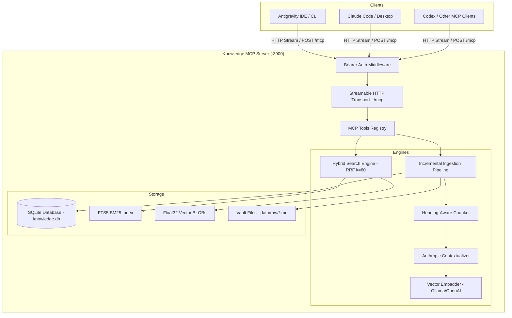

# 🧠 Knowledge MCP Server

**Knowledge MCP Server** là hệ thống quản lý và truy xuất kiến thức cá nhân (Local Knowledge Base) hiệu năng cao, expose qua giao thức chuẩn **Model Context Protocol (Streamable HTTP)**. Server cho phép các AI coding assistant và agent (như **Antigravity CLI / IDE**, **Claude Code**, **ChatGPT / Codex**, **Cursor**,...) kết nối trực tiếp để tìm kiếm, đọc, tạo và mở rộng bộ nhớ kiến thức mà không phụ thuộc vào hạ tầng đám mây.

---

## 🌟 Điểm nổi bật (Key Features)

- ⚡ **Native SQLite & FTS5 (Zero External C++ Build)**: Sử dụng module `node:sqlite` (`DatabaseSync`) tích hợp sẵn trong Node.js, khởi động tức thì, hiệu năng truy vấn siêu nhanh và không gặp lỗi build binary trên Windows/macOS/Linux.
- 🎯 **Hybrid Search với RRF (Reciprocal Rank Fusion k=60)**: Kết hợp sức mạnh của Full-text BM25 search (SQLite FTS5) và Dense Vector Cosine Similarity (Embedding) để mang lại kết quả xếp hạng tối ưu nhất.
- 🧩 **Thông minh trong phân đoạn (Heading-Aware Chunking)**: Tự động phân tách Markdown theo phân cấp tiêu đề `H1 > H2 > H3`, bảo toàn YAML Frontmatter (`gray-matter`) và hỗ trợ overlap sliding window cho plain text.
- 🧬 **Anthropic Contextual Retrieval**: Tùy chọn sinh ngữ cảnh tự động cho từng chunk trước khi embed, nâng cao độ chính xác truy xuất ngữ nghĩa vượt trội.
- 🔄 **Incremental Ingestion (SHA256 Diffing)**: Chỉ nhúng lại những chunk có nội dung thay đổi, tiết kiệm tài nguyên tính toán và thời gian reindex.
- ✍️ **Tự động đồng bộ khi ghi/nối note (`write_note` & `append_note`)**: Bất cứ khi nào Agent ghi chú hoặc bổ sung kiến thức mới, file sẽ được tự động reindex vào cơ sở dữ liệu ngay lập tức.
- 🛡️ **Bảo mật & Streamable HTTP**: Hỗ trợ Bearer Token Authentication, chống tấn công Path Traversal, và tuân thủ chuẩn Streamable HTTP MCP transport.

---

## 🏗️ Kiến trúc hệ thống (System Architecture)



---

## 📋 Yêu cầu hệ thống (Prerequisites)

- **Node.js**: Phiên bản `>= 20.0.0` (Khuyến nghị Node 22+)
- **Embedding Provider**:
  - **Local (Khuyến nghị)**: [Ollama](https://ollama.com/) với model `nomic-embed-text`
    ```bash
    ollama pull nomic-embed-text
    ```
  - **Hoặc Cloud**: Bất kỳ endpoint OpenAI-compatible nào (`text-embedding-3-small`, v.v.)

---

## 🚀 Cài đặt & Khởi chạy (Quick Start)

### 1. Cài đặt Dependencies

```bash
git clone <repo-url>
cd knowledge-mcp
npm install
```

### 2. Thiết lập Biến môi trường (.env)

Sao chép file mẫu và cấu hình theo nhu cầu của bạn:

```bash
cp .env.example .env
```

Nội dung cấu hình trong `.env`:

```env
# Thư mục chứa tài liệu Markdown / Text
VAULT_DIR=./data/raw

# Đường dẫn lưu trữ SQLite Database
DB_PATH=./db/knowledge.db

# Cổng lắng nghe của MCP Server
PORT=3900

# Cấu hình Embedding (Mặc định: Ollama nomic-embed-text 768 chiều)
EMBEDDING_BASE_URL=http://localhost:11434/v1
EMBEDDING_MODEL=nomic-embed-text
EMBEDDING_API_KEY=ollama
EMBEDDING_DIM=768

# Anthropic Contextual Retrieval (Tùy chọn, mặc định: false)
CONTEXTUAL_RETRIEVAL_ENABLED=false
CHAT_BASE_URL=https://api.openai.com/v1
CHAT_MODEL=gpt-4o-mini
CHAT_API_KEY=your-openai-key

# Bảo mật: Bearer Token cho MCP client (Để trống nếu chạy local không cần auth)
MCP_AUTH_TOKEN=
```

### 3. Nạp dữ liệu vào Vault & Indexing

Thả các file ghi chú `.md` hoặc `.txt` của bạn vào thư mục `data/raw/` (hoặc thư mục được chỉ định tại `VAULT_DIR`), sau đó chạy lệnh index:

```bash
npm run reindex
```

Pipeline sẽ tự động:
1. Quét toàn bộ tài liệu trong vault.
2. Kiểm tra SHA256 để bỏ qua các file/chunk chưa từng thay đổi.
3. Phân đoạn nội dung theo heading `H1 > H2 > H3`.
4. Tạo vector embedding và lưu trữ vào SQLite kèm chỉ mục FTS5.
5. Dọn dẹp tự động (Cascade delete) các file đã bị xóa trên ổ đĩa.

### 4. Khởi động Server

**Chế độ phát triển (Development):**
```bash
npm run dev
```

**Chế độ Production:**
```bash
npm run build
npm start
```

Khi server khởi động thành công, bạn sẽ thấy thông báo:
```
============================================================
🧠 Knowledge MCP Server is running!
📡 Streamable HTTP Endpoint : http://localhost:3900/mcp
🏥 Health Check             : http://localhost:3900/health
🔐 Authentication           : Disabled (Local Dev Mode)
📂 Vault Directory          : D:\git\knowledge-mcp\data\raw
🗄️  Database                 : D:\git\knowledge-mcp\db\knowledge.db
============================================================
```

---

## 🛠️ Danh sách MCP Tools

Server cung cấp **8 công cụ MCP chuẩn**:

| Tool Name | Tham số đầu vào | Chức năng |
|---|---|---|
| `hybrid_search` | `query: string`, `k?: number` (default: 8) | Tìm kiếm kết hợp BM25 + Vector Cosine qua thuật toán **RRF (k=60)** |
| `keyword_search` | `query: string`, `k?: number` (default: 8) | Tìm kiếm từ khóa chính xác qua **SQLite FTS5 (BM25 ranking)** |
| `similar_notes` | `query: string`, `k?: number` (default: 8) | Tìm kiếm tương đồng ngữ nghĩa bằng **Vector Cosine Similarity** |
| `read_note` | `path: string` | Đọc toàn bộ nội dung của một file trong vault (chống path traversal) |
| `list_notes` | `prefix?: string` | Liệt kê tất cả các file ghi chú hiện có trong vault (lọc theo prefix) |
| `context_for_query` | `query: string`, `maxTokens?: number` (default: 2000) | Trích xuất và ghép các đoạn context liên quan nhất thành một khối Markdown hoàn chỉnh kèm nguồn |
| `write_note` | `path: string`, `content: string`, `overwrite?: boolean` | Tạo mới note trong vault và **tự động reindex tức thì** |
| `append_note` | `path: string`, `content: string` | Ghi thêm nội dung vào cuối note và **tự động reindex tức thì** |

---

## 🔌 Hướng dẫn kết nối MCP Clients

### 1. Antigravity CLI / IDE

Thêm vào file cấu hình global tại `~/.gemini/config/mcp_config.json` hoặc workspace `.agents/mcp_config.json`:

```json
{
  "mcpServers": {
    "knowledge-vault": {
      "type": "streamable-http",
      "url": "http://localhost:3900/mcp",
      "headers": {
        "Authorization": "Bearer YOUR_MCP_AUTH_TOKEN"
      }
    }
  }
}
```
*(Nếu không đặt `MCP_AUTH_TOKEN` trong `.env`, bạn có thể bỏ trường `headers`).*

---

### 2. Claude Code & Claude Desktop

Thêm vào file cấu hình `.mcp.json` ở thư mục project hoặc `claude_desktop_config.json`:

```json
{
  "mcpServers": {
    "knowledge-vault": {
      "type": "streamable-http",
      "url": "http://localhost:3900/mcp",
      "headers": {
        "Authorization": "Bearer YOUR_MCP_AUTH_TOKEN"
      }
    }
  }
}
```

---

### 3. Cursor & VS Code MCP Extensions

Trong phần cấu hình MCP Server của IDE:
- **Server Name**: `knowledge-vault`
- **Transport Type**: `Streamable HTTP` / `SSE`
- **URL**: `http://localhost:3900/mcp`
- **Headers**: `{"Authorization": "Bearer YOUR_TOKEN"}` *(nếu có)*

---

### 4. Codex / ChatGPT CLI

Cấu hình thông qua file config MCP của Codex theo định dạng Streamable HTTP endpoint: `http://localhost:3900/mcp`.

---

## 🧪 Kiểm thử (Testing)

Dự án đi kèm bộ test toàn diện kiểm tra mọi thành phần:

```bash
# Test riêng lẻ Database & FTS5
npx tsx scripts/test-db.ts

# Test Chunker Engine
npx tsx scripts/test-chunker.ts

# Test Search & RRF ranking
npx tsx scripts/test-search.ts

# Test toàn bộ MCP Server và 8 Tools
npx tsx scripts/test-mcp-server.ts
```

---

## ❓ Khắc phục sự cố (Troubleshooting)

| Vấn đề | Nguyên nhân | Cách khắc phục |
|---|---|---|
| `ECONNREFUSED 127.0.0.1:11434` | Ollama chưa được bật | Khởi động Ollama (`ollama serve`) và đảm bảo đã kéo model `ollama pull nomic-embed-text`. Server sẽ tự động fallback sang tìm kiếm từ khóa FTS5 mà không bị crash. |
| `listen EADDRINUSE :::3900` | Port 3900 đang bị chiếm | Đổi cổng khác trong file `.env` (ví dụ: `PORT=3901`). |
| `401 Unauthorized` | Sai hoặc thiếu Bearer token | Kiểm tra giá trị `MCP_AUTH_TOKEN` trong `.env` và khớp với header `Authorization: Bearer <TOKEN>` trên MCP client. |
| Kết quả tìm kiếm chưa cập nhật | Chưa reindex | Chạy lệnh `npm run reindex` hoặc sử dụng tool `write_note`/`append_note` để hệ thống tự động index. |

---

## 📜 Giấy phép (License)

Phát hành dưới giấy phép MIT. Thoải mái tùy biến và tích hợp vào hệ thống AI workflow của bạn!
