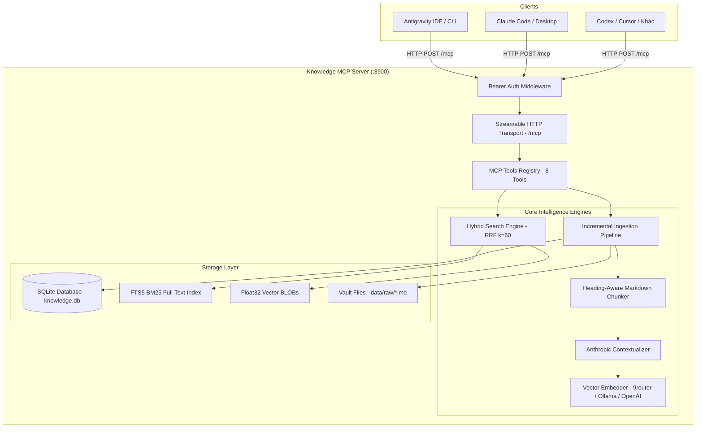

<div align="center">

# 🧠 Knowledge MCP Server (Bản Tiếng Việt)

**Hệ thống Quản lý Tri thức & Second Brain Cục bộ Hiệu năng cao cho AI Agent**

[](https://opensource.org/licenses/MIT)
[](https://nodejs.org/)
[](https://www.typescriptlang.org/)
[](https://modelcontextprotocol.io/)

[**English**](README.md) • [**Tiếng Việt**](README.vi.md) • [**Lộ trình phát triển**](ROADMAP.md) • [**Hướng dẫn cài đặt máy mới**](SETUP_NEW_MACHINE.md)

</div>

---

## 💡 Giới thiệu Knowledge MCP

**Knowledge MCP Server** là hệ thống quản lý tri thức cá nhân/doanh nghiệp và truy xuất tăng cường (RAG) hiệu năng cao, hoạt động hoàn toàn cục bộ (local-first) và expose qua giao thức mở **Model Context Protocol (MCP)**.

Hệ thống cho phép các trợ lý lập trình AI và Agent (**Antigravity IDE / CLI**, **Claude Code**, **Cursor**, **ChatGPT / Codex**, **Windsurf**) kết nối trực tiếp để tìm kiếm, đọc, cập nhật và ghi nhớ kiến thức dự án mà **không phụ thuộc dịch vụ đám mây** và **không sợ rò rỉ dữ liệu**.

```
┌─────────────────┐       Streamable HTTP       ┌──────────────────────────────────────┐
│  AI Assistants  │ ──────────────────────────> │        Knowledge MCP Server          │
│ (Antigravity /  │                             │ ┌──────────────────────────────────┐ │
│  Claude / Cursor│ <────────────────────────── │ │ Tìm kiếm lai (BM25 + Vector RRF) │ │
└─────────────────┘                             │ │ Anthropic Contextual Retrieval   │ │
                                                │ │ Heading-Aware Markdown Chunker   │ │
                                                │ │ Native SQLite FTS5 (Không lỗi C+)│ │
                                                │ └──────────────────────────────────┘ │
                                                └──────────────────────────────────────┘
```

---

## ✨ Điểm nổi bật (Key Features)

* ⚡ **Native SQLite & FTS5 (Không lo lỗi build C++)**: Sử dụng module `node:sqlite` (`DatabaseSync`) tích hợp sẵn trong Node.js, khởi động tức thì trong vài mili-giây và không bao giờ gặp lỗi biên dịch binary trên Windows/macOS/Linux.
* 🎯 **Tìm kiếm lai với thuật toán RRF (k=60)**: Kết hợp sức mạnh của Full-text BM25 search (**SQLite FTS5**) và Dense Vector Cosine Similarity (**Embedding**) để bắt chính xác từng biến, hàm, class và mã lỗi kỹ thuật.
* 🧩 **Phân đoạn thông minh theo Heading (Heading-Aware Chunking)**: Tự động phân tách Markdown theo phân cấp tiêu đề `H1 > H2 > H3`, bảo toàn YAML Frontmatter (`gray-matter`) mà không làm gãy ngữ cảnh.
* 🧬 **Anthropic Contextual Retrieval**: Tùy chọn sinh ngữ cảnh tự động cho từng chunk trước khi embed, triệt tiêu hiện tượng hallucination khi truy xuất tài liệu.
* 🔄 **Incremental Ingestion (SHA256 Diffing)**: Chỉ nhúng lại những chunk có nội dung thay đổi, tiết kiệm tài nguyên và thời gian reindex.
* ⚡ **Script 1-Click All-in-One (`setup-and-run.bat`)**: Tự động hóa toàn bộ từ kiểm tra môi trường, kết nối 9router, build, reindex, cài đặt rule cho Antigravity đến khởi chạy server trong 30 giây.
* 🛡️ **Tự động kích hoạt (Autonomous Agent Policy)**: Tích hợp sẵn policy và mô tả tool giúp AI tự động tra cứu Knowledge Vault trước khi trả lời câu hỏi kỹ thuật/nghiệp vụ.

---

## 📊 Bảng so sánh tính năng

| Tiêu chí | 🧠 Knowledge MCP | 📘 Google NotebookLM | 🤖 Mem0 | 📓 Obsidian MCP |
| :--- | :---: | :---: | :---: | :---: |
| **Môi trường hoạt động** | **Gắn trực tiếp trong IDE** | Web App Tab | Cloud/Python SDK | App Obsidian Desktop |
| **Bảo mật & Quyền riêng tư** | **100% Local / On-Prem** | Google Cloud | Cloud / SaaS | Local |
| **Khả năng Đọc & Ghi** | **Có (2 chiều)** | Chỉ đọc (Read-only) | Có | Có |
| **Kiến trúc tìm kiếm** | **BM25 + Vector RRF** | Vector / Context Window | Graph + Vector | Regex / Plaintext |
| **Tra cứu Symbol kỹ thuật** | **Chính xác 100% (FTS5)** | Dễ mờ nhạt | Semantic thuần | Cơ bản |
| **Contextual Retrieval** | **Có (chuẩn Anthropic)** | Không | Không | Không |
| **Cài đặt trên Windows** | **Zero C++ Build (Native)** | Cloud | Cần toolchain C++ | Cần Plugin Obsidian |
| **Chuẩn kết nối** | **MCP Streamable HTTP** | Web giao diện đóng | Custom API / MCP | Local REST / MCP |

---

## 🏗️ Kiến trúc hệ thống



---

## 🚀 Hướng dẫn Bắt đầu Nhanh (30 Giây)

### Cách 1: Chạy 1-Click All-in-One (Khuyến nghị trên Windows)
Nhấp đúp vào file [`setup-and-run.bat`](setup-and-run.bat) tại thư mục gốc dự án:
```powershell
.\setup-and-run.bat
```
> Script sẽ tự động: Kiểm tra Node.js $\rightarrow$ Ping 9router/Ollama $\rightarrow$ Build mã nguồn $\rightarrow$ Reindex dữ liệu $\rightarrow$ Tự cài đặt Rule & Tool Schemas vào Antigravity $\rightarrow$ Khởi chạy Server!

---

### Cách 2: Cài đặt Thủ công từng bước

1. **Clone repository:**
   ```bash
   git clone https://github.com/your-username/knowledge-mcp.git
   cd knowledge-mcp
   ```

2. **Cài đặt thư viện:**
   ```bash
   npm install
   ```

3. **Cấu hình file môi trường (`.env`):**
   ```bash
   cp .env.example .env
   ```
   *Cấu hình mẫu `.env`:*
   ```env
   VAULT_DIR=./data/raw
   DB_PATH=./db/knowledge.db
   PORT=3900

   # Embedding (Ollama hoặc 9router endpoint)
   EMBEDDING_BASE_URL=http://localhost:20128/v1
   EMBEDDING_MODEL=gemini/gemini-embedding-2-preview
   EMBEDDING_API_KEY=sk-dc085fc94dc709ea-8u73fh-aa082828
   EMBEDDING_DIM=768

   # Anthropic Contextual Retrieval (Tùy chọn)
   CONTEXTUAL_RETRIEVAL_ENABLED=true
   CHAT_BASE_URL=http://localhost:20128/v1
   CHAT_MODEL=mcp-local
   CHAT_API_KEY=sk-dc085fc94dc709ea-8u73fh-aa082828

   # Bảo mật (Để trống khi chạy local)
   MCP_AUTH_TOKEN=
   ```

4. **Lập chỉ mục tài liệu (Reindex):**
   Thả các file Markdown vào thư mục `data/raw/` và chạy:
   ```bash
   npm run reindex
   ```

5. **Khởi chạy Server:**
   ```bash
   npm run build
   npm start
   ```
   Endpoint MCP: `http://localhost:3900/mcp` | Health check: `http://localhost:3900/health`.

---

## 🛠️ Danh sách MCP Tools

Server cung cấp **8 công cụ MCP chuẩn**:

| Tool Name | Tham số đầu vào | Chức năng |
|---|---|---|
| `context_for_query` | `query: string`, `maxTokens?: number` | **Công cụ chính khuyến nghị.** Trích xuất và ghép các đoạn context liên quan nhất thành Markdown sẵn sàng nạp vào prompt cho LLM kèm trích dẫn nguồn. |
| `hybrid_search` | `query: string`, `k?: number` | Tìm kiếm kết hợp BM25 + Vector Cosine qua thuật toán **RRF (k=60)**. |
| `keyword_search` | `query: string`, `k?: number` | Tìm kiếm từ khóa chính xác qua **SQLite FTS5 (BM25 ranking)**. |
| `similar_notes` | `query: string`, `k?: number` | Tìm kiếm tương đồng ngữ nghĩa bằng **Vector Cosine Similarity**. |
| `read_note` | `path: string` | Đọc toàn bộ nội dung của một file trong vault (chống path traversal). |
| `list_notes` | `prefix?: string` | Liệt kê tất cả các file ghi chú hiện có trong vault (hỗ trợ lọc theo prefix). |
| `write_note` | `path: string`, `content: string`, `overwrite?: boolean` | Tạo mới note trong vault và **tự động reindex tức thì**. |
| `append_note` | `path: string`, `content: string` | Ghi thêm nội dung vào cuối note và **tự động reindex tức thì**. |

---

## 🔌 Hướng dẫn kết nối MCP Clients

### 1. Antigravity IDE / CLI
Thêm vào file `~/.gemini/config/mcp_config.json`:
```json
{
  "mcpServers": {
    "knowledge-vault": {
      "serverUrl": "http://localhost:3900/mcp"
    }
  }
}
```

### 2. Claude Code & Claude Desktop
Thêm vào `.mcp.json` hoặc `claude_desktop_config.json`:
```json
{
  "mcpServers": {
    "knowledge-vault": {
      "type": "streamable-http",
      "url": "http://localhost:3900/mcp"
    }
  }
}
```

### 3. Cursor & VS Code
Trong phần cấu hình MCP của IDE:
* **Name**: `knowledge-vault`
* **Type**: `Streamable HTTP` / `SSE`
* **URL**: `http://localhost:3900/mcp`

---

## 🧪 Kiểm thử (Testing)

```bash
# Chạy toàn bộ test suites (DB, Chunker, Search, MCP Server)
npm run test:all
```

---

## 🗺️ Lộ trình phát triển (Roadmap)

Xem chi tiết tại [ROADMAP.md](ROADMAP.md):
* ⚡ **Phase 1**: Live File Watcher thời gian thực (`chokidar`).
* ✂️ **Phase 2**: Surgical Note Editing (`update_section`, `patch_frontmatter`).
* 📄 **Phase 3**: Đọc đa định dạng tài liệu (PDF, Word, Excel).
* 🎯 **Phase 4**: Cross-Encoder Re-Ranking Pipeline.
* 🖥️ **Phase 5**: Local Web Dashboard & RAG Playground.

---

## 📜 Giấy phép (License)

Phát hành dưới giấy phép **MIT License**. Mọi đóng góp, issue và pull request đều được chào đón!
