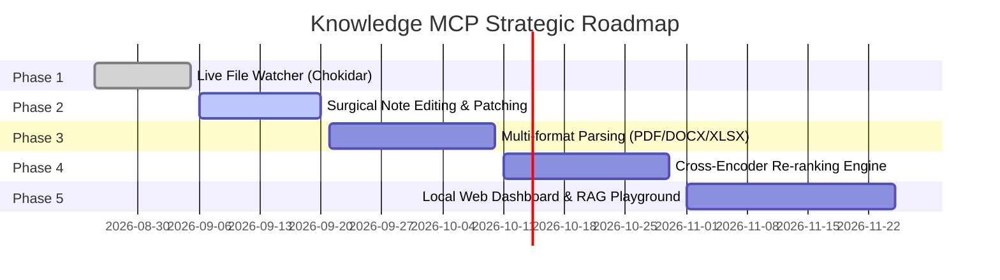

# 🗺️ Knowledge MCP - Development Roadmap

This document outlines the planned feature roadmap, architectural enhancements, and upcoming releases for **Knowledge MCP Server**.

---

## 📌 Release Milestones Overview

---

## 🚀 Phase Details

### ⚡ Phase 1: Real-Time Live File Watcher (Zero-Touch Reindexing)
* **Goal**: Eliminate manual `npm run reindex` commands when users edit notes externally in Obsidian, VS Code, or Notepad.
* **Key Tasks**:
  - [ ] Integrate `chokidar` file watching on `data/raw/` (or configured `VAULT_DIR`).
  - [ ] Debounce file change events (500ms - 1000ms window) to batch rapid keystroke saves.
  - [ ] Trigger selective incremental ingestion (SHA256 diffing) for added, modified, or deleted files.
  - [ ] Broadcast notification events to connected MCP clients if supported.

---

### ✂️ Phase 2: Surgical Note Editing & AST Patching
* **Goal**: Enable AI agents to perform granular, non-destructive updates to specific document sections rather than rewriting whole files.
* **Key Tasks**:
  - [ ] `update_section`: Locate exact Markdown heading path (`H1 > H2 > H3`) and replace/prepend/append text only in that section.
  - [ ] `patch_frontmatter`: Safely update YAML frontmatter metadata (tags, status, author, aliases).
  - [ ] `get_outline`: Return a lightweight hierarchy tree of document headings and token counts.
  - [ ] Automatic atomic rollback if patch validation fails.

---

### 📄 Phase 3: Multi-Format Document Ingestion
* **Goal**: Allow users to drag & drop enterprise documents (PDFs, Word docs, Excel impact matrices) directly into the knowledge vault.
* **Key Tasks**:
  - [ ] PDF Parser integration (`pdf-parse`) with layout and page number tracking.
  - [ ] Word Document Parser (`mammoth`) converting `.docx` structure into clean Markdown.
  - [ ] Excel/CSV Matrix Parser (`xlsx`) converting tabular data into readable Markdown tables.
  - [ ] Automatic media and table extraction.

---

### 🎯 Phase 4: Cross-Encoder Re-Ranking Pipeline
* **Goal**: Polish the top 15 RRF hybrid search results down to the 3–5 most relevant, high-precision context chunks for LLMs.
* **Key Tasks**:
  - [ ] Support local and remote Re-ranker endpoints (e.g. `bge-reranker-large`, Cohere Rerank API, 9router).
  - [ ] Score normalization and threshold filtering.
  - [ ] Dynamic token budget allocator for prompt injection.

---

### 🖥️ Phase 5: Local Web Dashboard & RAG Playground
* **Goal**: Provide a clean, modern local GUI at `http://localhost:3900/ui` for non-CLI management.
* **Key Tasks**:
  - [ ] **Vault Explorer**: Interactive file tree with rich Markdown live preview.
  - [ ] **RAG Playground**: Interactive search bar showing BM25 score, Vector cosine score, RRF rank, and assembled prompt context in real-time.
  - [ ] **Analytics**: Database size, total chunks, token distribution, and latency monitor.
  - [ ] **Drag & Drop Uploader**: Quick web-based file upload to vault.

---

## 🤝 Community & Contributions
We welcome contributions, RFCs, and feature suggestions! If you'd like to collaborate on any of these phases, please check out our [Contributing Guidelines](CONTRIBUTING.md) or open an issue on GitHub.
